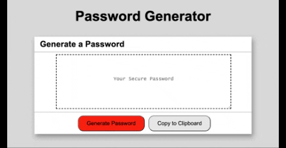

# Password-Generator
Generate a random password based on criteria they’ve selected by modifying starter code

This project solves the security concern of weak passwords. Given that a user needs a new, secured password, they will be prompted to determine certain character types required for the password.  After following prompt inputs a new password will be generated.  They will also have the ability to easily copy it to their clipboard.

The new password implements greater security to sensitive data and saves time for users.

The variables for the password are as follows:

the password is between 8 - 128 characters long

the password must have at least one of the following character types:
*lowercase alphebetic characters
*uppercasse alphebetic characters
*special characters
*numeric characters
*spaces
